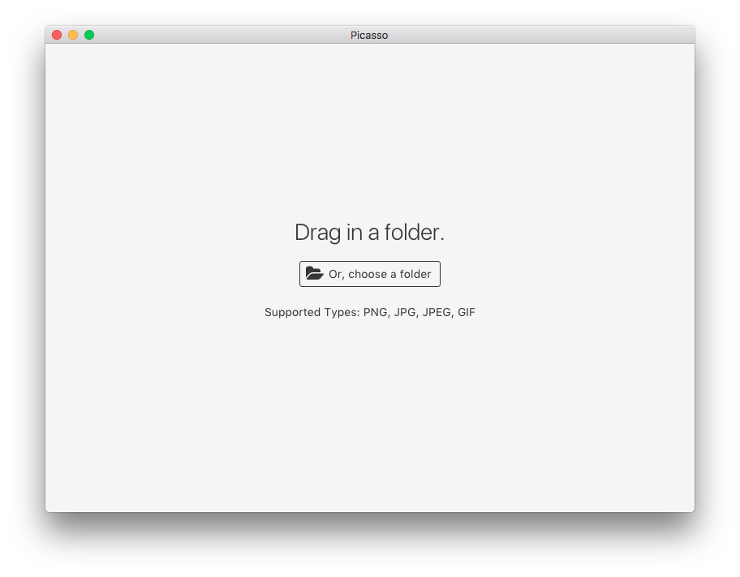
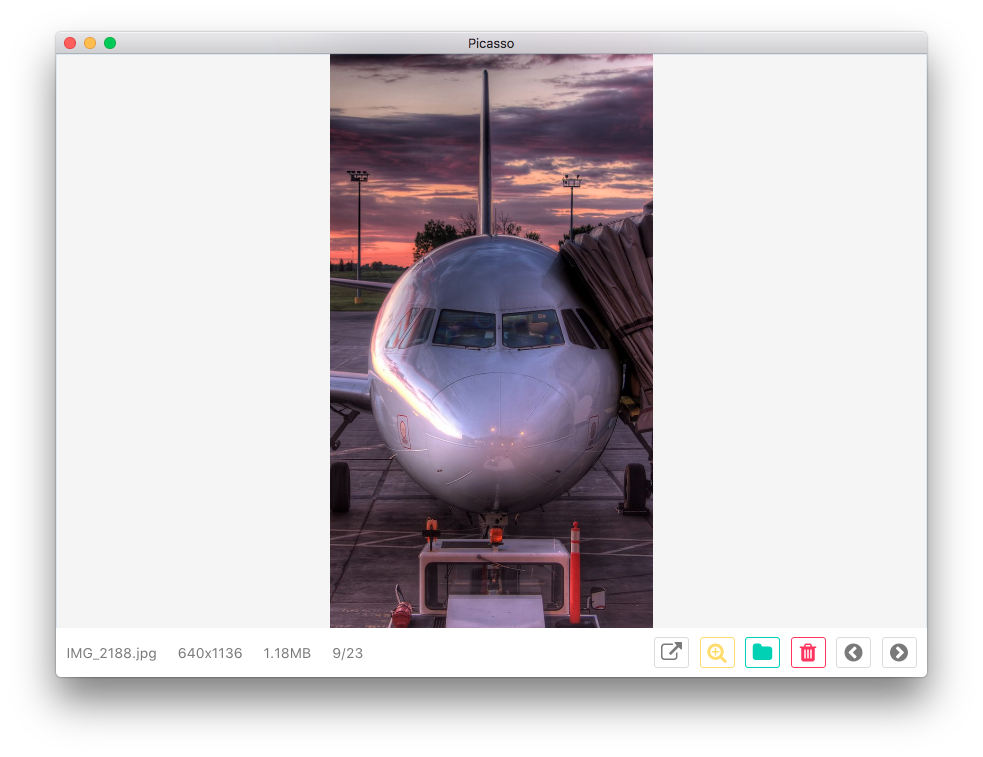
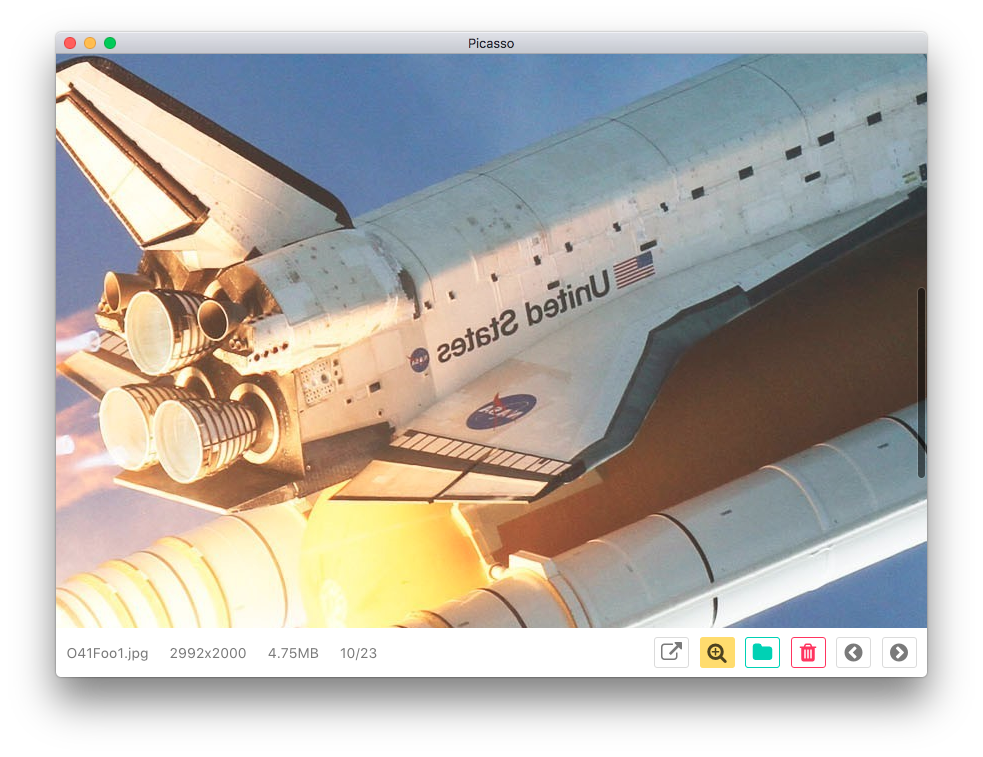
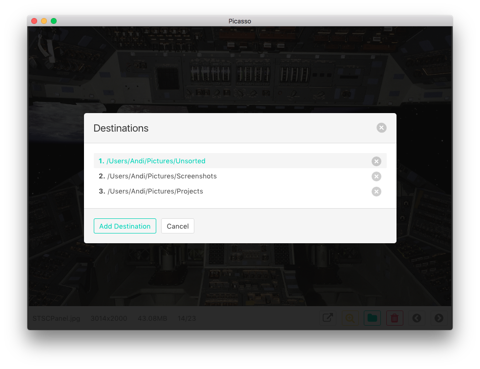
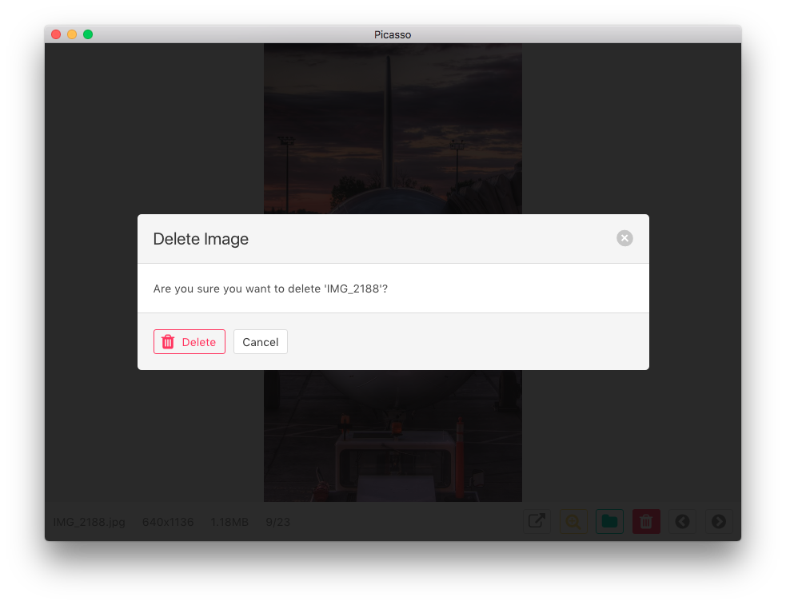
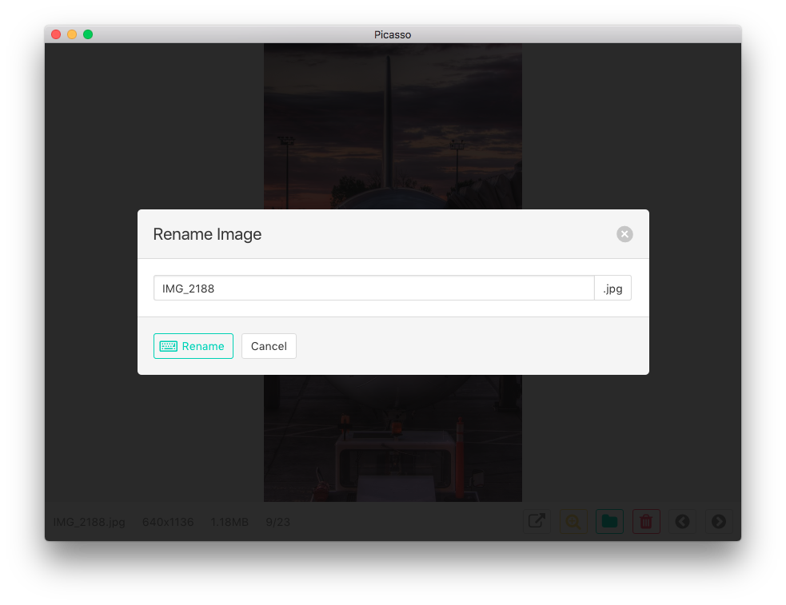
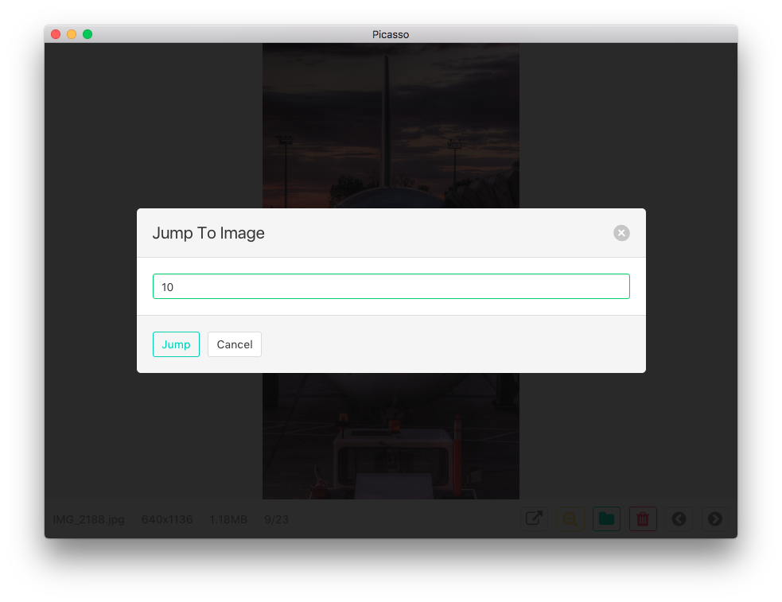

### Introduction
Picasso is a cross platform desktop app built on [Electron](http://electron.atom.io/) that helps organize folders containing pictures and videos. It was built with efficiency in mind. 

### Usage & Screenshots

Currently, there are no prebuilt binaries available. Creating them will be a goal in the future. For now, `cd` into the `src` directory and run `electron .` 

If you don't have Electron installed, run `npm install electron -g` to install it globally or see the [installation instructions](https://www.npmjs.com/package/electron).

This is the screen you'll see when you start up Picasso:


Once you've picked a folder, you'll be taken to the main screen. Notice the toolbar on the bottom - this will be how you interact with your images. Most of the buttons also have their own keyboard shortcuts as well. For example, you can use the left and right arrow keys as well as `A` and `D` to move between each image.


You can click the magnifying glass or press `Z` to zoom in on your current image:


Picasso has a feature called Destinations that allows you to specify certain places where you can move images. Press `O` or `Q` to open Destinations (or click the green folder in the toolbar), and any one of the number keys specified to complete the action. Of course, you can click on each entry as well.


To delete an image, hit the red trash can or press `X`. If you want to confirm the deletion quickly, you can hit `X` again with the dialog open.


To rename an image, click its name in the bottom left to open the rename dialog. Type in a new name and click Rename to confirm.



Finally, you can jump to a specific image quickly using the `G` key or by clicking the image number (to the right of the image size, it looks like "10/23"). Enter in a valid number and click Jump to confirm.


### Technologies

* [Electron](http://electron.atom.io/) as the desktop platform
* [Vue.js](https://vuejs.org/) as the view modeling library
* [Bulma](https://bulma.io) as the CSS framework
* [image-size](https://github.com/image-size/image-size) for detecting image sizes
* [trash](https://github.com/sindresorhus/trash) for support for moving files into the trash on each operating system

### Next Steps

* Beautify code
* Prebuilt binaries
* Add support for finding dimensions for videos

### License

```
MIT License

Copyright (c) 2017 Andi Andreas

Permission is hereby granted, free of charge, to any person obtaining a copy
of this software and associated documentation files (the "Software"), to deal
in the Software without restriction, including without limitation the rights
to use, copy, modify, merge, publish, distribute, sublicense, and/or sell
copies of the Software, and to permit persons to whom the Software is
furnished to do so, subject to the following conditions:

The above copyright notice and this permission notice shall be included in all
copies or substantial portions of the Software.

THE SOFTWARE IS PROVIDED "AS IS", WITHOUT WARRANTY OF ANY KIND, EXPRESS OR
IMPLIED, INCLUDING BUT NOT LIMITED TO THE WARRANTIES OF MERCHANTABILITY,
FITNESS FOR A PARTICULAR PURPOSE AND NONINFRINGEMENT. IN NO EVENT SHALL THE
AUTHORS OR COPYRIGHT HOLDERS BE LIABLE FOR ANY CLAIM, DAMAGES OR OTHER
LIABILITY, WHETHER IN AN ACTION OF CONTRACT, TORT OR OTHERWISE, ARISING FROM,
OUT OF OR IN CONNECTION WITH THE SOFTWARE OR THE USE OR OTHER DEALINGS IN THE
SOFTWARE.
```
